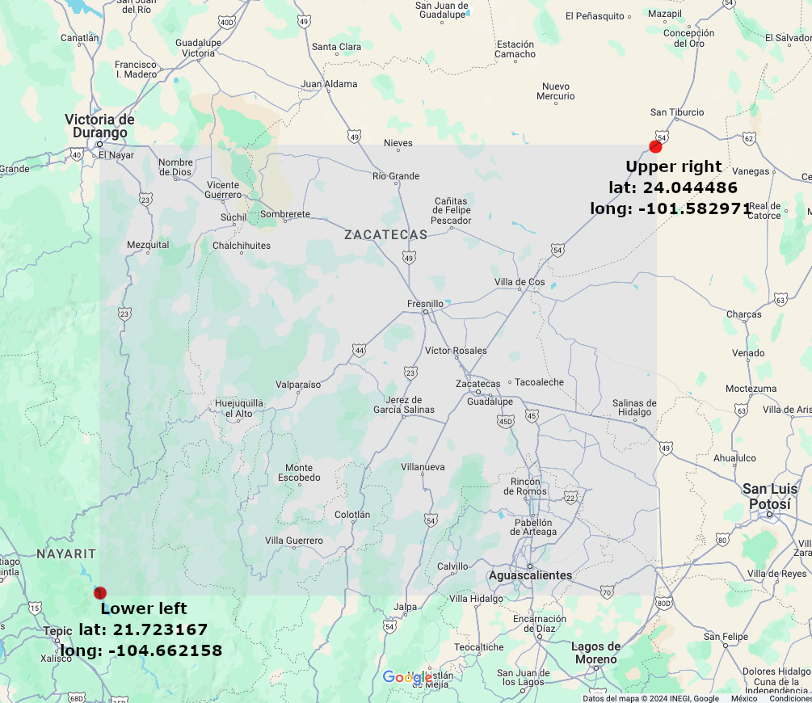

# Flymoon

A web app to run locally on a LAN network that checks for possible transits over the Moon or the Sun.

Get flight data from an existing API.

You need to set coordinates for an area to check flights as a bounding box, input your position, choose a target (Moon or Sun), and then the app will compute future flight positions and check intersections with the target, which is called a hit or transit.


The results show the difference in alt-azimuthal coordinates. Typically, you can expect a likely hit when there's no change in elevation and the difference in altitude (alt diff) and azimuth (az diff) is less than 5° for both. In such cases, the row of results will be highlighted.


--------


## Setup

**Pre-requisites**

- Python 3.9

**Install dependencies**

1) Run setup, this will create a virtual environment

```shell
make setup
```

2) Activate virtual env.

```shell
source .venv/bin/activate
```

**Configuration**

Open the `.env` file. You may need to display the hidden files.

1) Set `AEROAPI_API_KEY`. Sign up on [FlightAware AeroAPI](https://www.flightaware.com/commercial/aeroapi/) and use the [Personal free tier](https://www.flightaware.com/aeroapi/signup/personal) to generate an API KEY.

2) Set the area of flights to check. I strong suggest to cover a 15 min area. This must be a bounding box, using latitudes and longitudes. Set `LAT_LOWER_LEFT`, `LONG_LOWER_LEFT`, `LAT_UPPER_RIGHT`, and `LONG_UPPER_RIGHT` appropriately.





--------


## Usage


**Activate venv**

```shell
source .venv/bin/activate
```

Launch the web server from a terminal.

```shell
python3 app.py
```

The IP address in LAN network will be displayed, use it to access from any device inside the same network.

Example: `http://192.168.3.199:8000`

**Input your position (coordinates)**

I suggest using [MAPS.ie](https://www.maps.ie/coordinates.html#google_vignette) or [Google Maps](https://maps.google.com/). The values will be saved in local storage, so you won't need to type them again next time if you're in the same location.


**Compute possible transits**

Click on Go! button to display results. Each row will include differences in alt-azimuthal coordinates only if it’s a possible hit. If the difference is very small, the row will be highlighted in yellow or green color.


--------


## Limitations

1) Computing the moment when there is a minimum difference between a plane and the target in alt-azimuthal coordinates is a numerical approach. Perhaps there could be an analytical way to optimize it.

2) Currently, the ETA is not very exact since we are not taking into account air resistance, changes in elevation, and the direction of the plane. It is assumed that the plane will have a constant speed and direction.

3) At the moment, there is no notification module, but one could be implemented to further automate the process.


--------


## Contribute

This web app is still under active testing. If you want to fix something, improve it, or make a suggestion, feel free to open a Pull Request or an issue.