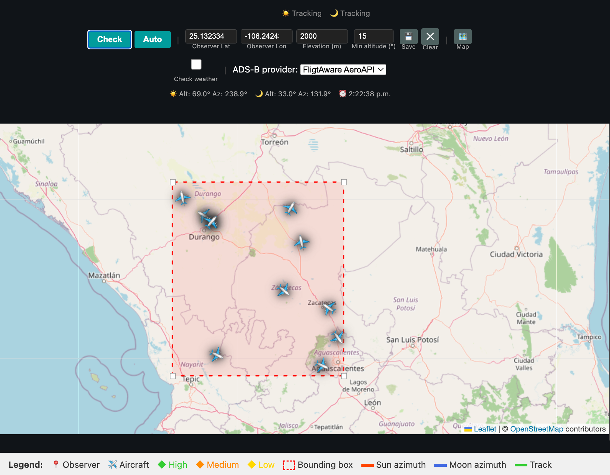
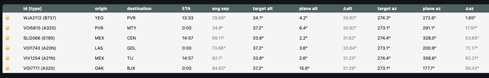

# Flymoon

A web app to run locally on a LAN network that checks for possible transits over the Moon or the Sun (up to several minutes ahead).

Get flight data from an existing ADSB provider API.


You need to set coordinates for an area to check flights as a bounding box, input your position, choose a target (Moon, Sun or both), and then the app will compute future flight positions and check intersections with the target, which is called a transit.





The results show the future and minimum angular separation from aircraft and the chosen target. Typically, you can expect a likely transit when there's expected a lower angular separation, no change in elevation and the difference in altitude (alt diff) and azimuth (az diff, both not in all cases) is less than a few degrees for both. In such cases, the row of results will be highlighted:

| Color | Possibility |
|---|---|
| 🟡 Yellow | Low |
| 🟠 Orange | Medium |
| 🟢 Green | High |


**Main features**
1. Check transits on demand (user click on _Check_ button)
2. Check transits on Auto mode (each X chosen minutes the app checks, send push notification and sounds alert)
3. Display aircrafts over a map (position, direction and altitude, highlighed when a transit is predicted)
4. Display results, ordered by more probable transits to less probable ones
5. Check weather, min altitude and targets above horizon before getting API flight data
6. Personal gallery (you can organize your own collection of transits)
7. Background monitor (run Flymoon in auto mode without a browser, only the Terminal is required)
--------


## ⚠️ Safety Warning

> **Never look at the Sun directly or through any optical equipment (camera, telescope, binoculars) without certified solar filters.** Solar radiation can cause permanent eye damage or blindness in fractions of a second. Always attach a full-aperture front filter **before** pointing equipment at the Sun.


--------


## Setup & Configuration

See [SETUP.md](SETUP.md) for full installation and configuration instructions (interactive wizard and manual setup).


--------


## Usage

### Web app

Activate venv and launch the server:

```shell
# macOS/Linux
source .venv/bin/activate && python3 app.py

# Windows
.venv\Scripts\activate && python app.py
```

Access it from any device on the same network (the LAN address is printed on startup):
- From another device: `http://192.168.x.x:8000`
- From the host: `http://localhost:8000`

Enter your latitude, longitude and elevation (saved in local storage). Use [MAPS.ie](https://www.maps.ie/coordinates.html) or Google Maps to get your coordinates.

**Key controls:**
- **Check** — compute transits now
- **Auto** — repeat every X minutes; plays a sound and sends a push notification on medium/high probability transits
- **Target icon** — toggle between Moon, Sun, and Auto mode (tracks whichever is above the horizon)
- **Map button** — interactive map with your position, bounding box, azimuth arrows, and aircraft (◆ = predicted transit)

Click a table row or map aircraft to cross-highlight between them.

**Weather filtering:** if `OPENWEATHER_API_KEY` is set in `.env`, cloud cover is checked before each run (threshold: `CLOUD_COVER_THRESHOLD`, default 85%).


--------


## Background Monitor

Run Flymoon in auto mode from the terminal, no browser needed.

**macOS/Linux**
```shell
python3 monitor.py --lat <LAT> --long <LONG> --elev <ELEV> [options]
```

**Windows**
```shell
python windows_monitor.py
```

**Options for `monitor.py`:**

| Argument | Default | Description |
|---|---|---|
| `--lat` | required | Observer latitude |
| `--long` | required | Observer longitude |
| `--elev` | required | Observer elevation (meters) |
| `--target` | `auto` | `moon`, `sun`, or `auto` |
| `--interval` | `12` | Check interval in minutes |
| `--adsb` | `flightaware-aeroapi` | ADS-B provider (`flightaware-aeroapi` or `airlabs`) |
| `--min-alt` | `15` | Minimum target altitude (degrees) |
| `--notify` | off | Send push notifications |
| `--weather` | off | Check weather before each run |
| `--test` | off | Test mode |


--------

## Limitations

1) Computing the moment when there is a minimum angular separation between a plane and the target is a numerical approach. Perhaps there could be an analytical way to optimize it.

2) The app assumes that airplanes maintain a constant speed and direction. However, changes to these factors within a several-minute observation window can alter the ETA and potentially disrupt the predicted transit.


--------

## Contribute

This web app is still under active testing. If you want to fix something, improve it, or make a suggestion, feel free to open a Pull Request or an issue. Please, don't forget testing proposal code before opening a PR.


-------

See [CHANGELOG.md](CHANGELOG.md) for release history.


**Share your epic picture!**

I'd love to watch some transit picture taken with the help of this tool. So, post it on this [issue](https://github.com/dbetm/flymoon/issues/21).