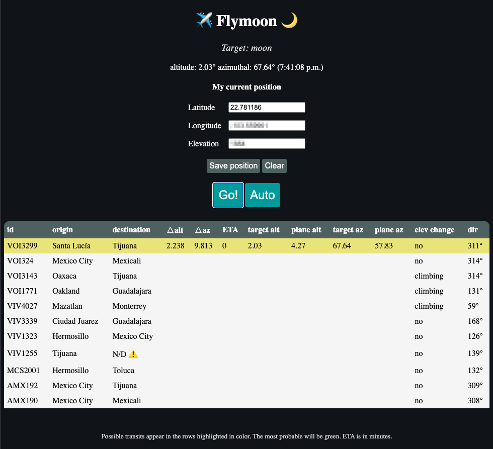

# Flymoon

A web app to run locally on a LAN network that checks for possible transits over the Moon or the Sun (up to 15 minutes ahead).

Get flight data from an existing API.

You need to set coordinates for an area to check flights as a bounding box, input your position, choose a target (Moon or Sun), and then the app will compute future flight positions and check intersections with the target, which is called a transit.




The results show the difference in alt-azimuthal coordinates. Typically, you can expect a likely transit when there's no change in elevation and the difference in altitude (alt diff) and azimuth (az diff) is less than 3° for both. In such cases, the row of results will be highlighted. Yellow 🟡: Medium possibility. Green 🟢: High possibility.


--------


## Setup

**Pre-requisites**

- Python 3.9

**Install dependencies**

1) Run setup, this will create a virtual environment

```shell
make setup
```

2) Activate virtual env.

```shell
source .venv/bin/activate
```

**Configuration**

Open the `.env` file. You may need to display the hidden files.

1) Set `AEROAPI_API_KEY`. Sign up on [FlightAware AeroAPI](https://www.flightaware.com/commercial/aeroapi/) and use the [Personal free tier](https://www.flightaware.com/aeroapi/signup/personal) to generate an API KEY.

2) Set the area of flights to check. I strong suggest to cover a 15 min area. This must be a bounding box, using latitudes and longitudes. Set `LAT_LOWER_LEFT`, `LONG_LOWER_LEFT`, `LAT_UPPER_RIGHT`, and `LONG_UPPER_RIGHT` appropriately.

3) (Optional) When using the auto mode If you want to receive notifications in your smartphone, you can get an API KEY from [Pushbucket platform](https://www.pushbullet.com/) and then set `PUSH_BULLET_API_KEY`. To get it, create an account, install the app in your phone and go to *Settings* > *Create Access Token*.


--------


## Usage


**Activate venv**

```shell
source .venv/bin/activate
```

Launch the web server from a terminal.

```shell
python3 app.py
```

The IP address in LAN network will be displayed, use it to access from any device inside the same network.

Example: `http://192.168.3.199:8000`

**Input your position (coordinates)**

I suggest using [MAPS.ie](https://www.maps.ie/coordinates.html#google_vignette) or [Google Maps](https://maps.google.com/). The values will be saved in local storage, so you won't need to type them again next time if you're in the same location.


**Compute possible transits**

Click on Go! button to display results. Each row will include differences in alt-azimuthal coordinates only if it’s a possible transit. If the difference is very small, the row will be highlighted in yellow or green color.

**Compute possible transits every X minutes**

Click on Auto button, which will require a time in minutes, then the web app will check for transits every X minutes, it there's at leat one possible transit then a sound alert will be played along the sending of a push notification if it was configured.

**Change target**

Tap into the target icon and it'll toggle between Sun and Moon.


--------


## Limitations

1) Computing the moment when there is a minimum difference between a plane and the target in alt-azimuthal coordinates is a numerical approach. Perhaps there could be an analytical way to optimize it.

2) The app assumes that airplanes maintain a constant speed and direction. However, changes to these factors within the 15-minute observation window can alter the ETA and potentially disrupt the predicted transit.


--------


## Contribute

This web app is still under active testing. If you want to fix something, improve it, or make a suggestion, feel free to open a Pull Request or an issue.


**Share your epic picture!**

I'd love to watch some transit picture taken with the help of this tool. So, post it on this [issue](https://github.com/dbetm/flymoon/issues/21).

Pro-tip: You can use the Fightradar24 app to complement this web app.