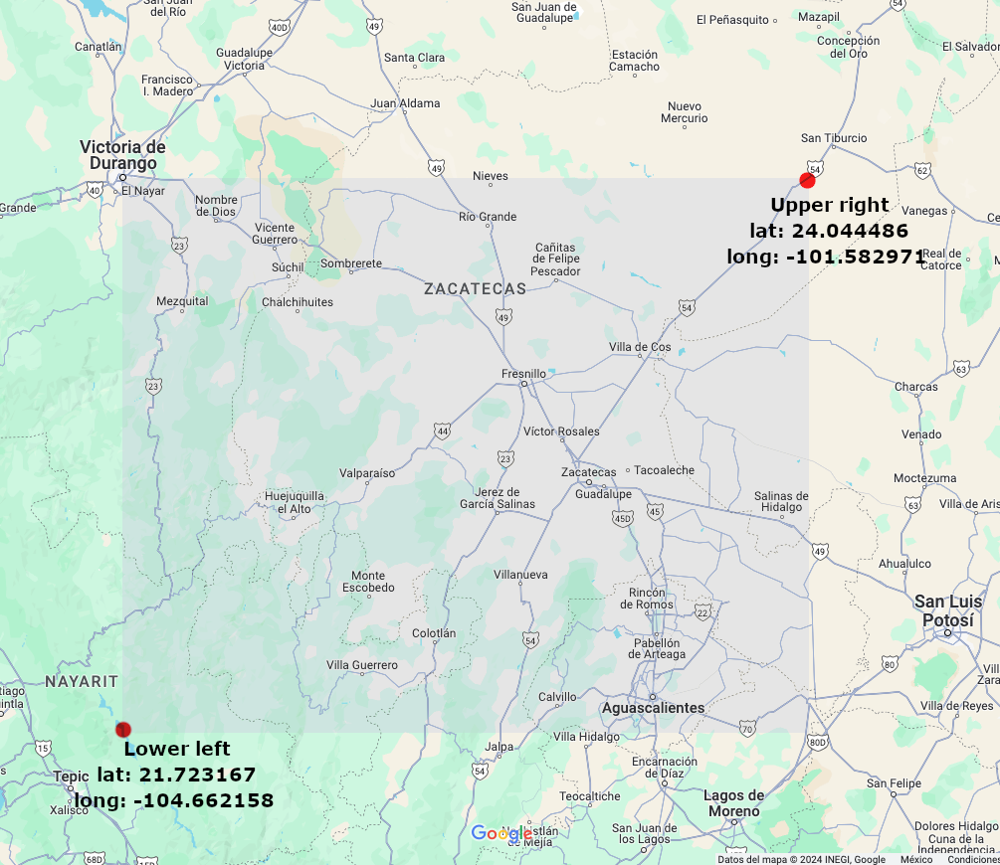

# Flymoon — Setup & Configuration

## Pre-requisites

- Python 3.9+
- Download or clone this project from GitHub. If you downloaded a zip file, extract it first.

---

## Installation

### Linux / macOS

1. Open a Terminal and navigate to the project directory.
2. Run setup — this creates a virtual environment and installs all required dependencies:

```shell
make setup
```

3. Activate the virtual environment:

```shell
source .venv/bin/activate
```

### Windows

1. Open CMD and navigate to the project directory.
2. Create the `.env` file from the template:

```shell
copy .env.mock .env
```

3. Create a virtual environment:

```shell
python -m venv .venv
```

4. Activate it:

```shell
.venv\Scripts\activate
```

5. Install dependencies:

```shell
pip install -r requirements.txt
```

---

## Configuration

You need to set up at minimum an ADSB API key and a bounding box before running the app. You can do this interactively with the wizard or manually by editing the `.env` file.

### Option A — Interactive wizard (recommended)

Run the wizard and follow the on-screen prompts:

```shell
python3 src/config_wizard.py --setup
```

On Windows, use `python` instead of `python3`:

```shell
python src\config_wizard.py --setup
```

The wizard guides you through 4 steps:

1. **ADSB Provider API key** — At least one is required for real-time flight data. You can set one or both:
   - [FlightAware AeroAPI](https://flightaware.com/aeroapi/signup/personal) *(recommended, 100 free requests/month)*
   - [AirLabs](https://airlabs.co/) *(1000 free requests/month)*

2. **Flight search area** — A bounding box covering roughly a 15-minute flight radius from your location. Use [MAPS.ie](https://www.maps.ie/coordinates.html) or Google Maps to find coordinates. You can also adjust it visually from the map view in the browser after launching the app.

3. **Push notifications** *(optional)* — A [Pushbullet](https://www.pushbullet.com/) API key to receive smartphone alerts when a transit is detected in auto mode.

4. **Weather filtering** *(optional)* — An [OpenWeatherMap](https://openweathermap.org/api) API key to skip transit checks when cloud cover is too high.

All settings are saved to the `.env` file. You can re-run the wizard at any time to update your configuration.

To validate the current configuration without making changes:

```shell
python3 src/config_wizard.py --validate
```

---

### Option B — Manual setup

Open the `.env` file with any text editor. You may need to enable hidden files visibility in your file explorer.

> On Windows, if you don't have a suitable text editor, [Notepad++](https://notepad-plus-plus.org/downloads/) is a good option.

**Required**

| Variable | Description |
|---|---|
| `AEROAPI_API_KEY` | [FlightAware AeroAPI](https://www.flightaware.com/aeroapi/signup/personal) key — recommended, 100 free requests/month |
| `AIRLABS_API_KEY` | [AirLabs](https://airlabs.co/) key — alternative, 1000 free requests/month |
| `LAT_LOWER_LEFT` / `LONG_LOWER_LEFT` | Southwest corner of the flight search area |
| `LAT_UPPER_RIGHT` / `LONG_UPPER_RIGHT` | Northeast corner of the flight search area |

At least one ADSB key is required. The bounding box should cover roughly a 15-minute flight radius from your location. Use [MAPS.ie](https://www.maps.ie/coordinates.html) or right-click on Google Maps to get coordinates. You can also fine-tune the box visually from the map view in the browser after launching the app.



**Optional**

| Variable | Description |
|---|---|
| `PUSH_BULLET_API_KEY` | [Pushbullet](https://www.pushbullet.com/) key for smartphone push notifications in auto mode. Go to *Settings* > *Create Access Token* after installing the app. |
| `OPENWEATHER_API_KEY` | [OpenWeatherMap](https://openweathermap.org/api) key for weather-based filtering (skips checks when too cloudy). |
